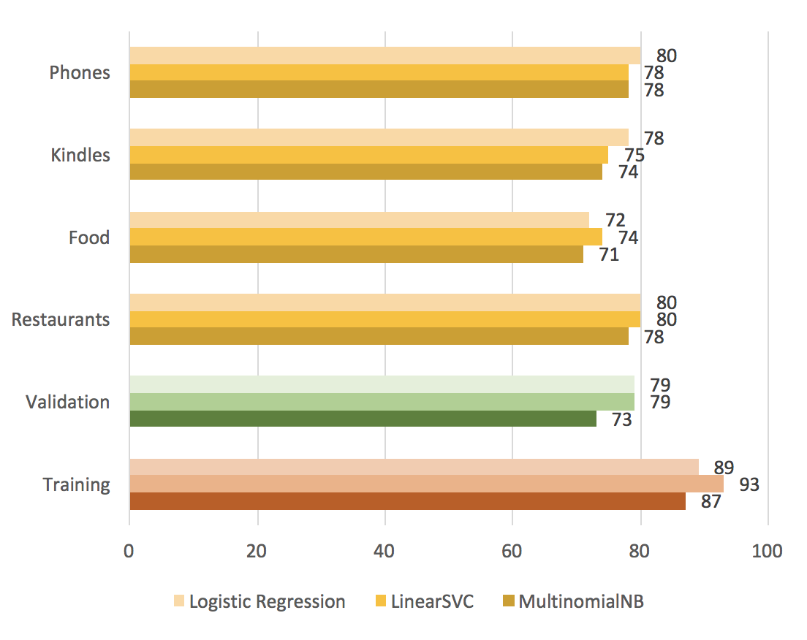
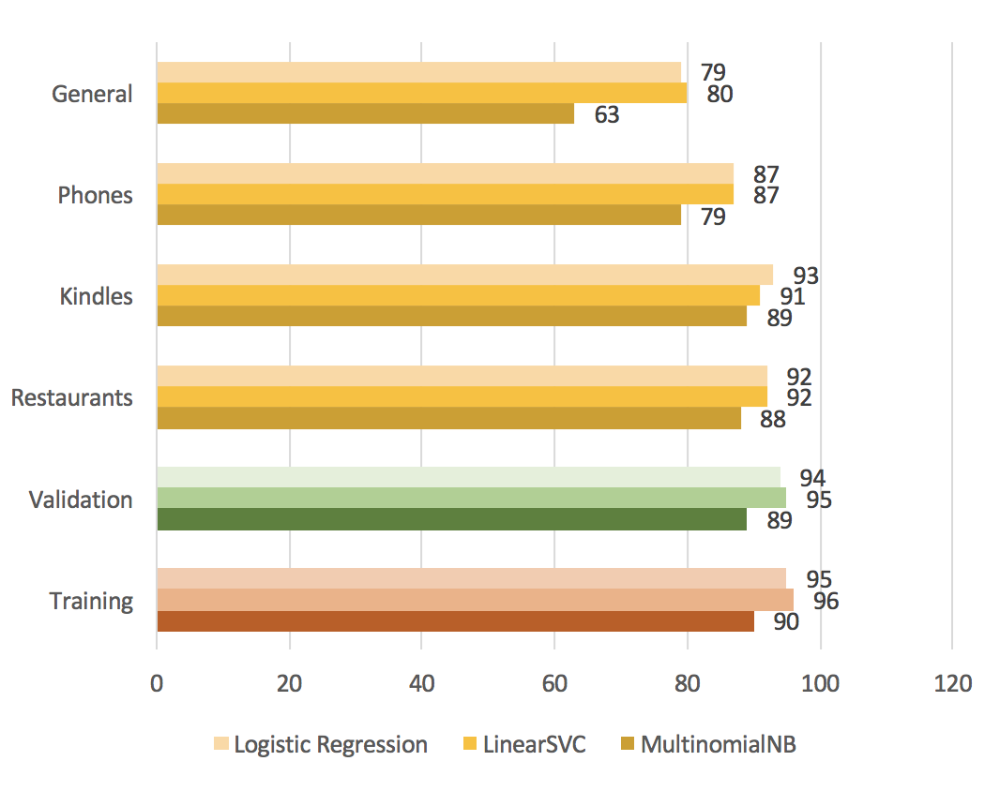
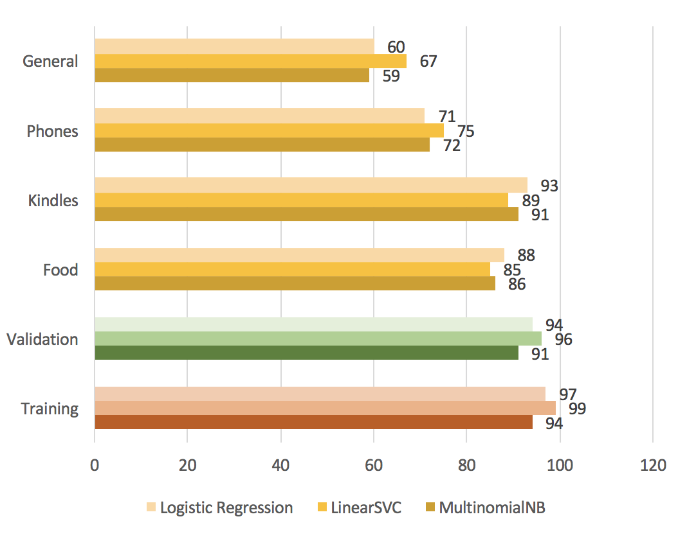

## IFT6390 Final Project (submitted December 22, 2017) 
# Sentiment Analysis of Consumer Reviews Within and Across Product Categories

### Acknowledgements
**Vanessa Prinsen**   
*(Laboratoire de traitement de l’information en santé, École de technologie supérieure)* 
* programming, general and cross-domain testing, initial draft of final report    

**Maibang Khounvongsa**   
*(Département d’informatique et de recherche opérationnelle, Université de Montréal)*
* research, general analysis and report writing  

## Abstract
Product reviews are an important source of information for businesses about the impact of marketing campaigns and the success of new products. Machine learning can be used to transform unstructured text into structured data for decision making. In this paper, we apply sentiment analysis to labelled consumer product reviews using three supervised learning algorithms: Naive Bayes (NB), Logistic Regression (LR) and Support Vector Machine (SVM/SVC). We observed that SVC and LR are better suited than NB for specific domains, and NB performed better on smaller datasets than on larger ones. Classifiers trained on at least 15000 examples were able to achieve 90%+ accuracy on cross-domain classification. We confirmed the general wisdom that the quantity and richness of training examples has the greatest impact on classification performance, moreso than domain of knowledge or type of algorithm.

<!---
## Approach

### Classifiers
We investigate three types of classifiers often used for natural language processing: Naive Bayes, Logistic Regression, and Support Vector Machine. The scikit-learn toolkit offers several implementations of these classifiers, so we will test a total of 6 algorithms---the best of each type will be retained for intra-domain and cross-domain testing:

**1. Naive Bayes [Bernoulli (BernoulliNB), Gaussian (GaussianNB), Multinomial (MultinomialNB)]:** Popular baseline method for text classification. Naive Bayes classifiers have a closed-form solution, which can be evaluated in linear time, and are highly scalable. With appropriate pre-processing, they are competitive with more advanced methods, and produce good results for smaller datasets or documents. However, the assumption of independence is restrictive for text classification since language is naturally context dependent.  
**2. Logistic Regression (or Maximum Entropy):** Commonly used as an alternative to Naive Bayes. Since these classifiers do not assume that features are independent, they are more robust to correlations found in word features. However, training is slower than for Naive Bayes since Logistic Regression is a convex optimization problem, in which the parameters must be learned iteratively with an optimization algorithm such as gradient descent.   
**3. Support Vector Classifier [Linear (LinearSVC), Radial Basis (NuSVC )]:** Another popular option for text classification. SVC deals well with high-dimensional and sparse feature vectors, but can be computationally complex to scale up for larger datasets (neural networks are more suitable for these cases). The kernel trick gives the classifier more flexibility to combine features, and the automatic weight adjustment reduces the need for manual feature selection. 
---> 
### Datasets  
Dataset short name | Domain  |   Size | Positive | Negative   | Filename 
-----|---|---|---|---|----
General [2] | General | 1000 | 500 | 500 | amazon_cells_labelled.txt     
Kindles [1] | Electronics | 1053 | 977 | 76 | sa_processed_7817_1.txt      
Phones [4] | Electronics      | 27101  | 16429 | 10678  | Amazon_unlocked_phones.txt  
Food [3] | Food     | 525814     | 443777 | 82037  | amazon_fine_foods_cleaned.txt  
Restaurants [5] | Food     | 15101 | 12930 | 2171 | tripadvisor_reviews.txt  
         
The five datasets summarized in the table above were used for testing. These datasets came in a variety of formats (text, csv, sqlite) but were exported to a standard tab-delimited text format, with the review text in field 1 and the label (0 for negative or 1 for positive) in field 2. This removed the need to handle multiple file formats or perform extensive pre-processing on the files. When testing general algorithm performance, these datasets were additionally be split into a training set (80% of examples) and a validation set (20% of examples).

## Selected results: Cross-domain training accuracy
*Algorithm accuracy after training on:*  

| General dataset   |  Foods dataset    |   Restaurants dataset   |
:-------------------------:|:-------------------------:|:-------------------------:
 |    |  
    
## References
[1] Datafiniti. Dataset: consumer reviews of Amazon products. Retrieved from https://www.kaggle.com/datafiniti/consumer-reviews-of-amazon-products.  
[2] Kotzias et al. From group to individual labels using deep features. KDD 2015. Retrieved from
https://archive.ics.uci.edu/ml/datasets/Sentiment+Labelled+Sentences.  
[3] McAuley, J. and J. Leskovec. From amateurs to connoisseurs: modeling the evolution of user expertise through online reviews. WWW, 2013. Retrieved from https://www.kaggle.com/snap/amazon-fine-food-reviews.   
[4] PromptCloud. Amazon reviews: unlocked mobile phones. Retrieved from https://www.kaggle.com/PromptCloudHQ/amazon-reviews-unlocked-mobile-phones.  
[5] PromptCloud. London-based restaurants’ reviews on TripAdvisor. Retrieved from https://www.kaggle.com/PromptCloudHQ/londonbased-restaurants-reviews-on-tripadvisor.  
