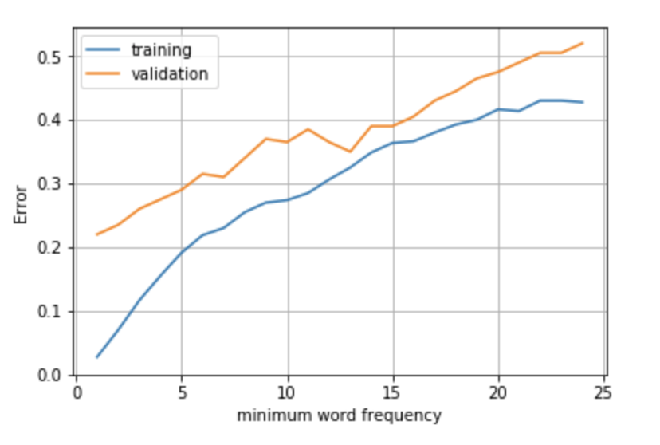
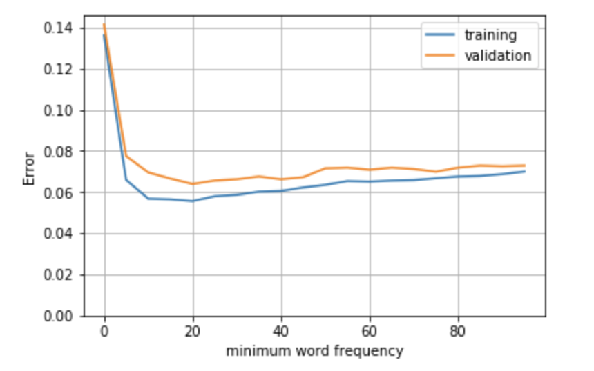

## IFT6390 Final Project: 
# Sentiment Analysis of Consumer Reviews Within and Across Product Categories

### Acknowledgements
Vanessa Prinsen (Laboratoire de traitement de l’information en santé, École de technologie supérieure): 
* programming, general and cross-domain testing, initial draft of final report    

Maibang Khounvongsa (Département d’informatique et de recherche opérationnelle, Université de Montréal): 
* research, general analysis and report writing  

## Abstract
Product reviews are an important source of information for businesses about the impact of marketing campaigns and the success of new products. Machine learning can be used to transform unstructured text into structured data for decision making. In this paper, we apply sentiment analysis to labelled consumer product reviews using three supervised learning algorithms: Naive Bayes (NB), Logistic Regression (LR) and Support Vector Machine (SVM/SVC). We observed that SVC and LR are better suited than NB for specific domains, and NB performed better on smaller datasets than on larger ones. Classifiers trained on at least 15000 examples were able to achieve 90%+ accuracy on cross-domain classification. We confirmed the general wisdom that the quantity and richness of training examples has the greatest impact on classification performance, moreso than domain of knowledge or type of algorithm.
<!---
## Introduction

Product reviews are an important source of information for businesses because they can be used to measure the impact of marketing campaigns and the success of new products for decision-making purposes. This feedback on customers' perception of a business compared to competitors and their level of satisfaction or dissatisfaction can help build better products and provide better service, which will have an effect on revenues and profits. 

Machine learning can be used to transform the unstructured text of product reviews into structured data in an automated way, but sentiment analysis is a challenging task for computers: people express opinions in complex ways using natural language, and the interpretation of a given text as positive or negative is often unclear even for human readers. Furthermore, otherwise positive words ("good") can change meaning dramatically depending on context ("good for nothing").

In addition, natural language analysis has its own unique challenges: high dimensional but sparse feature vectors, which are more suited to certain machine learning algorithms than others, and frequently imbalanced datasets (for example, many more positive examples than negative ones, or vice versa). 

In this paper, we apply sentiment analysis to labelled product reviews, drawn in part from two domains (food and electronics). We are interested in evaluating the performance of this analysis with respect to: 
1. Size of dataset: how is performance affected by using smaller vs. larger datasets?
2. Domain of knowledge: are classifiers more accurate when trained on domain-specific text? Are classifiers portable from one domain of knowledge to another? 
3. Type of algorithm: which algorithms perform best under which conditions? Are our results consistent with the theory and other studies in the literature?

We discuss our findings and recommendations for sentiment analysis applied to customer product reviews. We conclude with questions for future work. 

## Approach

### Classifiers
We investigate three types of classifiers often used for natural language processing: Naive Bayes, Logistic Regression, and Support Vector Machine. The scikit-learn toolkit offers several implementations of these classifiers, so we will test a total of 6 algorithms---the best of each type will be retained for intra-domain and cross-domain testing:

**1. Naive Bayes [Bernoulli (BernoulliNB), Gaussian (GaussianNB), Multinomial (MultinomialNB)]:** Popular baseline method for text classification. Naive Bayes classifiers have a closed-form solution, which can be evaluated in linear time, and are highly scalable. With appropriate pre-processing, they are competitive with more advanced methods, and produce good results for smaller datasets or documents. However, the assumption of independence is restrictive for text classification since language is naturally context dependent.  
**2. Logistic Regression (or Maximum Entropy):** Commonly used as an alternative to Naive Bayes. Since these classifiers do not assume that features are independent, they are more robust to correlations found in word features. However, training is slower than for Naive Bayes since Logistic Regression is a convex optimization problem, in which the parameters must be learned iteratively with an optimization algorithm such as gradient descent.   
**3. Support Vector Classifier [Linear (LinearSVC), Radial Basis (NuSVC )]:** Another popular option for text classification. SVC deals well with high-dimensional and sparse feature vectors, but can be computationally complex to scale up for larger datasets (neural networks are more suitable for these cases). The kernel trick gives the classifier more flexibility to combine features, and the automatic weight adjustment reduces the need for manual feature selection. 
---> 
### Datasets  
Dataset short name | Domain  |   Size | Positive | Negative   | Filename 
-----|---|---|---|---|----
General | General | 1000 | 500 | 500 | amazon_cells_labelled.txt     
Kindles | Electronics | 1053 | 977 | 76 | sa_processed_7817_1.txt      
Phones | Electronics      | 27101  | 16429 | 10678  | Amazon_unlocked_phones.txt  
Food | Food     | 525814     | 443777 | 82037  | amazon_fine_foods_cleaned.txt  
Restaurants | Food     | 15101 | 12930 | 2171 | tripadvisor_reviews.txt  
         
The five datasets summarized in the table above were used for testing. These datasets came in a variety of formats (text, csv, sqlite) but were exported to a standard tab-delimited text format, with the review text in field 1 and the label (0 for negative or 1 for positive) in field 2. This removed the need to handle multiple file formats or perform extensive pre-processing on the files. When testing general algorithm performance, these datasets were additionally be split into a training set (80% of examples) and a validation set (20% of examples).

<!---
### Preprocessing and feature extraction
Before any training begins, we will remove common stop words (taken from NLTK’s corpus), punctuation, and digits from the examples. NLTK’s mark_negation function will also be used to add a basic notion of positive vs. negative context to our training, by tagging any words in a sentence that follow a negative word (for example, the sentence "this is not good" would be transformed into "this is not good_NEG").
The tfidf vectorizer will be used as it supports lists of texts natively and produces a memory-efficient sparse representation of the data, which will allow us to work with our largest dataset (n=525814).
The vectorizer will extract unigram features from our training text, and furthermore will restrict the features to those that appear with a minimum frequency in the document. This minimum frequency is a hyper-parameter which must be adjusted depending on the size of the dataset. This hyper-parameter must be carefully chosen to ensure a maximum of useful features are included, without choosing so many that the classifier begins to overfit the training data or slow down the performance of the system.
For example, for the General dataset (n=1000), we use a minimum frequency of 4 (i.e. use only words which appear at least 4 times across all training examples). On a small dataset like this one, word features are important regardless of their frequency. On the other hand, a minimum frequency of 25 is used for the Restaurant dataset (n=15101) to balance the large number of examples. Using too many uncommon features with this dataset would cause overfitting and reduce the accuracy of the classifier. The graphs of the learning curves for these two datasets are shown below.
(a) Learning curve on general dataset (n=1000) (b) Learning curve on restaurants dataset (n=15101) Figure 1: Learning curves for feature selection

The table below summarizes the minimum word frequencies (with the corresponding number of features) chosen for the different datasets tested in this project.

*Table 2: Minimum word frequencies used*  

Dataset short name | Size  | Min. word freq. | \# of features  
---|---|---|---
General | 1000 | 4 | 236     
Kindles     | 1053 | 4  | 2104    
Phones      | 27101     | 25 | 2444 
Food      | 525814     | 50  |  15740  
Restaurants     | 15101 | 25 | 2592 

Once the features are selected, the vectorizer transforms our datasets into sparse bag-of-words representations that can be passed directly to our classifiers’ train functions. Once the training is completed, we can obtain a list of the most informative features for each classifier. Reported in Appendix 1 are the results trained on the Restaurant dataset. On the left column are the top 10 negative features and on the right, the top 10 positive features, along with the coefficient of their weights. Not surprisingly (since they tend to obtain similar performance accuracy), the most informative features for SVC and Logistic Regression are more similar than those for Naive Bayes.

## Results
### Algorithm performance
Figure 2: Algorithm accuracy on validation set, by dataset (random seed 514)
(Alg accuracy)[images\1-general_results.png]

Our results show that 1) the best performing versions of these algorithms (on average) are the Multinomial Naive Bayes, Linear SVC and Logistic Regression, and 2) that Support Vector Classifiers and Logistic Regression outperform Naive Bayes most of the time.
**Analysis:** Support Vector Classifiers and Logistic Regression tend to perform better than Naive Bayes in all datasets except for the General domain dataset where their performances are similar. SVC and LR are better suited for domain-specific learning, and the independence assumption makes Naive Bayes ill suited for context-specific environments. Thus, Naive Bayes (a model with low variance) gives similar performance in all domains, whereas SVC and LR are no better than Naive Bayes in the general domain and better in specific domains. SVM and LR have low bias, which means that they are very accurate at modelling the training data but tend to overfit, so they do not generalize so well.
We also observe that Naive Bayes performs better on the smaller datasets (General and Kindles) than on the larger ones, as predicted by the theory.
**Naive Bayes:** For most datasets (except the smallest, general domain one), the Multinomial Naive Bayes algorithm gave the best results out of all the Naive Bayes algorithms. The Multinomial algorithm takes into account the values of the features (counts or frequencies), which allows it to get a closer fit than the strictly binary Bernoulli algorithm.
The Bernoulli Naive Bayes nevertheless gave acceptable results. Its performance is comparable to (or even better than) the Multinomial Naive Bayes algorithm for the smallest dataset of 1000 examples, but it lagged behind for the larger and more complex datasets.
The Gaussian Naive Bayes algorithm is not well-suited to text as it does not handle sparse data well (a Gaussian is not a good fit for data where the bulk of values are 0). Because of this, the GaussianNB algorithm does not accept the sparse data representation created by the vectorizer, and needed to be passed a full array. This made the algorithm unusable on the largest dataset of 500,000 examples.
**SVC:** The NuSVC (with radial basis function) algorithm has quadratic fit complexity, which makes it poorly suited to larger datasets. In practice, we saw that this algorithm took a long time to train on our larger datasets, and was unusable on our largest 500,000 example dataset.

In contrast, the LinearSVC algorithm uses a different implementation which scales much better (close to linearly) and was able to handle the largest dataset. It accepts sparse input which reduces memory requirements, particularly during training.

### Domain Analysis
Following the tests described above, the three algorithms with the best performance (Multinomial Naive Bayes, Linear SVC, and Logistic Regression) were used to train classifiers and compare their performance on intra-domain and cross-domain sentiment analysis (see graphs in Appendix 2 for full results).
The main takeaway from these graphs is that sample size has a greater impact on sentiment analysis performance than the type of algorithm or the domain of knowledge. Also, sentiment analysis of consumer reviews makes accurate predictions across different product domains. Classifiers trained on at least 15000 examples were able to achieve 90%+ accuracy on cross-domain classification.
Classifiers trained on reviews of food/restaurants seem better able to generalize to unrelated datasets than those trained on reviews of electronics products, suggesting that the vocabulary used in restaurant and food reviews is more generalizable than that used in reviews of mobile phones or e-readers. The decision to strip digits from reviews may have had an impact here, as it is likely that reviews of mobile phones include more numerical content (model numbers, battery life estimates, repair delays, etc.) than reviews of restaurants or food products.
The classifier trained on the General dataset (n=1000, one-sentence reviews) produced consistently acceptable results (70-80%) on larger datasets, regardless of the target dataset’s size or domain of knowledge. However, larger datasets were not necessarily good at generalizing to smaller, less- detailed review text. None of the datasets could do better than 80% accuracy on the General dataset, though all performed over 85% when tested against the larger datasets.
This may be a result of the necessary focus of a small dataset - with a limited quantity of text, only the most important and telling features rise to the top to guide the classifier. Conversely, a larger dataset provides a richer set of features to classify with, but those features may get diluted and become unable to classify simpler text.
One notable failure in the cross-domain testing occurred with the Kindles dataset (n=1053, multi- sentence reviews). The classifiers trained on this dataset did no better than a coin flip when tested against the generalized dataset. This can be explained by looking at the balance of positive vs. negative examples in the training set: this dataset is heavily skewed towards positive reviews, which means it performs well only on other datasets that are very positively-skewed. When applied to balanced datasets, it vastly over-predicts positive sentiment.
An examination of incorrectly classified examples show that text with a mix of positive and negative opinions was the hardest to classify:

**Example 1: Predicted: positive, actual: negative.**
*Training set: Phones. Test set: Restaurants.*
> I love tonkotsu and was disappointed to find that theirs was bland: like the user G7_G7 said in his review, the broth should have been more creamy.Service was excellent and prices were OK but if they called the restaurant after the tonkotsu soup then they should be able to serve a proper one which is not the case for now unfortunately.

**Example 2: Predicted: negative, actual: positive.**
*Training set: General. Test set: Kindles.*
> Only 4 stars because I found it very confusing at first. I had a Kindle before found it very easy to find what I needed to do. The user guide didn’t really answer my questions, but I persisted am getting used to it. I really love the backlit screen no buttons to push to change pages. At first I wasn’t sure about the smaller screen, but didn’t take long to get over that. I’m sure I’m just a creature of habit not very techy. All in all, the Kindle Paperwhite is great.

### Size of dataset
The analysis of algorithm performance in section 3.1 shows that Naive Bayes performs better on the smaller datasets than on the larger ones, whereas Support Vector Classifier and Logistic Regression are less sensitive to sample size. The cross-domain results in 3.2 show that the size of the dataset had a much greater impact on classification performance than the type of algorithm or domain of knowledge. The greater the size of the dataset, the better the performance, regardless of domain of knowledge. There is not a lot of difference in the performance of these classifiers in the training and validation sets (except for the smaller General dataset) and the accuracy is quite high (90%+), suggesting good fit. The General dataset is clearly overfit, which causes its performance to be poor on outside samples (no more than 80% accuracy). Although sentiment analysis applied across domains give good predictions in general, accuracy is lower when applied to the smaller General dataset, and relatively lower when the training dataset is smaller (Kindles less portable than Phones, and Restaurants less portable than Foods). Accuracy is also lower when applied to larger datasets (Food and Phones), especially when the training dataset is smaller.

## Conclusions
In this paper, we applied sentiment analysis to labelled consumer product reviews using three supervised learning algorithms: Naive Bayes, Logistic Regression and Support Vector Machine. We analyzed the performance of text classification with respect to size of the dataset, domain of knowledge and type of algorithm. Our primary conclusion is that sample size has a greater impact on the performance of the classification task than the type of algorithm or the domain of knowledge. SVC and LR are better suited than NB for specific domains, and NB performs better on smaller datasets than on larger ones. In general, sentiment analysis of consumer reviews is able to make accurate predictions across different product domains.
Following our results, our recommendations are:
1. A balanced dataset should be used. A heavily-skewed dataset (whether positive or negative) is unable to generalize to other data and is not suitable for supervised classifier training.
2. Domain is not as important as quality of the dataset (number of examples, balanced).
3. The more examples, the better.
For future work, it would be interesting to see the impact of more careful pre-processing and feature selection, particularly for the Naive Bayes classifier which underperforms compared to other methods on specific product domains. Using bi-gram features may improve accuracy, particularly within specific domains (for example, "battery life" could be a very telling feature for electronics reviews). On the other hand, experimenting with different types of regularization could be useful to reduce overfitting of SVC and Logistic Regression by removing or reducing the weights of features that do not generalize well.
Alternatively, we could use a neural network for our sentiment analysis, especially for our largest dataset. Although more complex to implement, we would benefit from its ability to learn the complex structures within raw text reviews. Hence, it would simplify data pre-processing and automatically choose which features are relevant, eliminating the need to manually set a threshold for word frequency to include for each dataset. Also, it would be interesting to see how applying an advanced technique such as a recurrent neural network, whose sequential structure is especially suited for language modelling, would compare to the performance of our algorithms across domains since we do not take into account this structure in our current analysis.

## References
[1] Datafiniti. Dataset: consumer reviews of Amazon products. Retrieved from https://www. kaggle.com/datafiniti/consumer-reviews-of-amazon-products.
[2] Jurafsky, D. and J. H. Martin. Speech and language processing. Pearson, 2014.
[3] Kotzias et al. From group to individual labels using deep features. KDD 2015. Retrieved from
https://archive.ics.uci.edu/ml/datasets/Sentiment+Labelled+Sentences.
[4] Manning, C. D. et al. Introduction to Information Retrieval. Cambridge University Press, 2008.
[5] McAuley, J. and J. Leskovec. From amateurs to connoisseurs: modeling the evolution of user expertise through online reviews. WWW, 2013. Retrieved from https://www.kaggle.com/ snap/amazon-fine-food-reviews.
[6] PromptCloud.Amazonreviews:unlockedmobilephones.Retrievedfromhttps://www.kaggle. com/PromptCloudHQ/amazon-reviews-unlocked-mobile-phones.
[7] PromptCloud. London-based restaurants’ reviews on TripAdvisor. Retrieved from https://www. kaggle.com/PromptCloudHQ/londonbased-restaurants-reviews-on-tripadvisor.

## Appendix 1: Most informative features (Restaurants dataset)
**NAIVE BAYES:**
-10.8890 apology_NEG -10.8890 inedible -10.6052 unpleasant -10.5829 horrible -10.4843 appalling -10.4238 refused -10.4218 annoyed -10.4120 disgusting -10.3944 joke
-10.3585 worse
**SVC:**
-3.7036 poor
-3.3387 worst -2.6896 inedible -2.6643 terrible -2.6424 bland -2.5038 rude
-2.4483 mediocre -2.3380 unfortunately -2.3060 tasteless -2.2771 awful
-4.7448 food -4.7484 good -4.8537 great -5.0567 service -5.2110 staff -5.2640 restaurant -5.3228 place -5.3330 friendly -5.4255 nice -5.4266 ’s
3.0903 delicious 2.9426 great
2.9223 excellent 2.6128 good
2.4847 amazing 2.3204 recommend 2.2926 friendly 1.8657 excellent_NEG 1.7931 tasty
1.7718 lovely

**LOGISTIC REGRESSION:**
-5.8242 poor
-4.3100 worst -3.8652 terrible -3.8185 disappointed -3.8137 rude
-3.7731 disappointing -3.6266 bland -3.5131 cold
-3.4756 awful -3.3116 tasteless
5.7282 great 5.0194 good 4.8276 excellent 4.8028 delicious 4.1512 friendly 3.7107 recommend 3.5552 amazing 3.2791 lovely 2.8300 tasty 2.7920 fresh

--->

## Selected results: Cross-domain training accuracy
*Algorithm accuracy after training on... *  

| General dataset [3]  |  Foods dataset [5]   |   Restaurants dataset [7]   |
:-------------------------:|:-------------------------:|:-------------------------:
 |    |  
    
## References
[1] Datafiniti. Dataset: consumer reviews of Amazon products. Retrieved from https://www. kaggle.com/datafiniti/consumer-reviews-of-amazon-products.  
[2] Jurafsky, D. and J. H. Martin. Speech and language processing. Pearson, 2014.  
[3] Kotzias et al. From group to individual labels using deep features. KDD 2015. Retrieved from
https://archive.ics.uci.edu/ml/datasets/Sentiment+Labelled+Sentences.  
[4] Manning, C. D. et al. Introduction to Information Retrieval. Cambridge University Press, 2008.  
[5] McAuley, J. and J. Leskovec. From amateurs to connoisseurs: modeling the evolution of user expertise through online reviews. WWW, 2013. Retrieved from https://www.kaggle.com/ snap/amazon-fine-food-reviews.   
[6] PromptCloud.Amazonreviews:unlockedmobilephones.Retrievedfromhttps://www.kaggle. com/PromptCloudHQ/amazon-reviews-unlocked-mobile-phones.  
[7] PromptCloud. London-based restaurants’ reviews on TripAdvisor. Retrieved from https://www. kaggle.com/PromptCloudHQ/londonbased-restaurants-reviews-on-tripadvisor.  
